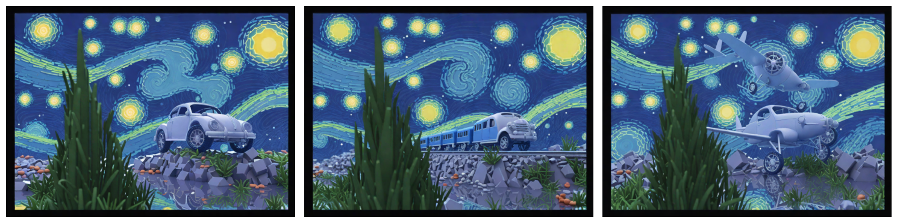
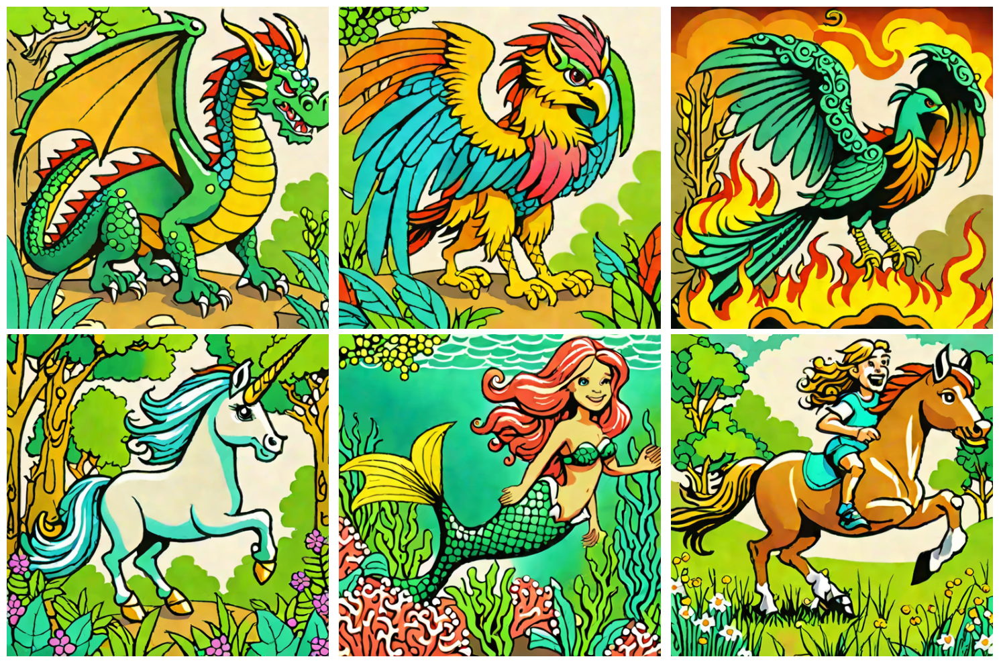
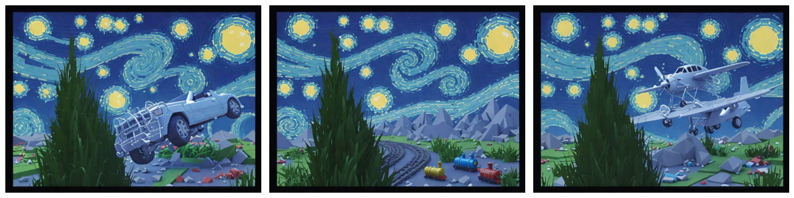
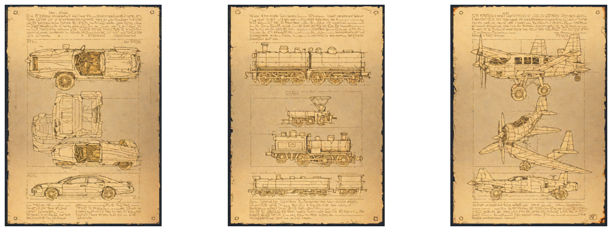

# Style Aligned Image Generation via Shared Attention
*Emanuele Frasca, Enrico Maria Aldorasi*

[[Arxiv]](https://arxiv.org/abs/2312.02133) | [[Original Project Page]](https://style-aligned-gen.github.io/)

This repository provides the implementation of the method described in the paper "**Style Aligned Image Generation via Shared Attention**" *[arXiv:2312.02133]*. The method employs a shared attention mechanism to generate images that are not only realistic but also maintain consistent styles across both text-to-image and image-to-image generation tasks. It builds upon the Stable Diffusion pipelines, ensuring compatibility with existing Stable Diffusion models.

Below can be seen an example of `Text2Image` generated images of our implementation.


Instead, the following is an example of an image generated through `Image2Image` by exploiting a reference image.




## Key Features:
- **Shared Attention Mechanism:** Enhances the quality and style alignment of generated images by modifying attention layers within diffusion models.
- **Stable Diffusion Compatibility:** The method is compatible with existing Stable Diffusion models, allowing for easy integration and use.
- **No Additional Training Required:** The shared attention mechanism can be applied to existing models without the need for additional training, making it easy to incorporate into existing pipelines.
- **Text-to-Image Generation:** Produces style-consistent images from given text prompts.
- **Image-to-Image Generation:** Uses reference images to generate new images while maintaining style consistency by leveraging the `Image2Image` pipeline from the diffusers library.


## Installation
To install the necessary dependencies, run:

```bash
pip install diffusers torch matplotlib
```

Or just run completely the Jupyter notebook, wich contains the magic command `%pip install diffusers torch matplotlib` at the beginning of the file.

## Usage

To generate images using the shared attention mechanism, you can use the the provided Jupyter notebook `style-aligned-image-generation-via-shared-attention.ipynb`.

Steps to use the notebook:
1.	Start by loading the notebook in a Jupyter environment.
2.	Modify the last cell to input your desired prompts and specify the number of diffusion steps.
3.	The notebook will generate and display the style-aligned images directly within the Jupyter environment.

The function returns the generated images in a format compatible with Jupyter notebooks, making it easy to visualize and fine-tune the results as needed.

### Parameters Description

**Attenction Mechanism (Shared Attention):**
- `scale` : The scale factor for the attention mechanism. A higher scale factor will increase the impact of the shared attention mechanism on the generated images.

**Image Generation (Text-to-Image and Image-to-Image):**
- `prompt`: The text prompt(s) used to generate the image(s)
- `num_inference_steps`: The number of diffusion steps to use when generating the image(s).

**Image-to-Image only:**
- `image`: The reference image used for image-to-image generation tasks.
- `strength`: The strength of the transformation applied to the reference image, with higher values leading to more significant changes.
- `guidance_scale`: A factor that balances the adherence to the text prompt against the creativity of the generation. Higher values will closely match the text prompt, lower values will allow for more creative interpretations.

## Results

The shared attention mechanism is effective in generating style-aligned images that maintain consistent styles across different generation tasks. Below are some examples of images generated using the method.




---





## Source

```bibtex
@article{hertz2023StyleAligned,
  title={Style Aligned Image Generation via Shared Attention},
  author={Hertz, Amir and Voynov, Andrey and Fruchter, Shlomi and Cohen-Or, Daniel},
  journal={arXiv preprint arXiv:2312.02133},
  year={2023}
}
```